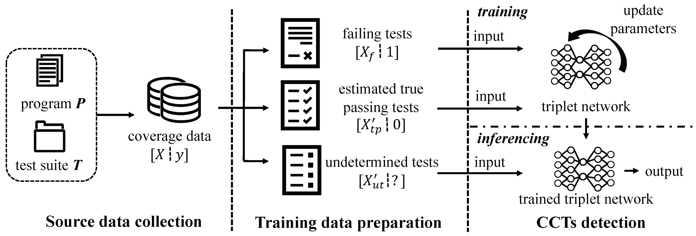

# TriCoCo
TriCoCo, a triplet network-based coincidental correctness detection approach.
The aim of TriCoCo is higher detection precision.
## Overview of TriCoCo

### Step 1: True passing tests identification
To build a more accurate model, we need to prepare the input data more cautiously.
We are inspired by the existing CC detection approaches.
They can generally obtain high recall values but low precision values.
Thus, we can obtain true passing tests by the set difference operation.
### Step 2: CCT detection
The input data are the identified true passing tests and the failing tests.
Triplet network are adopted for the distance metric learning between the two classes of data.
After training process, the network can infer the probability of each test in the undetermined tests.

## Quick Start
### Requirements
- OS: Linux
- Python Package:
   - chardet==4.0.0
   - numpy==1.20.3
   - pandas==1.3.4
   - pyclustering==0.10.1.2
   - PyYAML==6.0
   - scikit_learn==1.2.1
   - scipy==1.7.1
   - torch==1.10.2

``pip install -r requirements.txt``

### Empirical Study
The scripts below are running with our hand-made data Chart-0 for a quick start.
The full Defects4J coverage data can be found at https://bitbucket.org/rjust/fault-localization-data/src/master/
#### RQ1
- Run the scripts in `./cc/cc_baselines`

The output can be found under folder `./results/`

#### RQ2
- Run the scripts in `./cc/survey_pipeline`
- 
The output can be found under folder `./results/`

### Evaluation

#### RQ3 & RQ4
- Run the script: `./cc/triplet_cc_identify/run_triplet.py`

The output can be found under folder `./results/`

Eample output:

- origin_record.txt
  - meaning: ``program-id real_cc_num detected_cc_num intersection_of_them``
  - example: ``Chart-0	4	4	4``
- record.txt
  - meaning: ``program-id recall precision F1``
    - example: ``Chart-0	1.0	1.0	1.0``
- approach_MFR.txt or approach_MAR.txt
  - meaning: ``program-id MFR_or_MAR_value_list``
  - example: ``Chart-0	1	1	1``
- time.txt
  - meaning: ``program-id time_cost``
  - example: ``Chart-0	12.20``

## Project Structure
```
TriCoCo
├── CONFIG.py
├── requirements.txt
├── cc
│   ├── CCGroundTruthPipeline.py
│   ├── CCinfo.yaml
│   ├── ReadData.py
│   ├── allinfo.yaml
│   ├── cc_baselines        # baselines
│   ├── cc_evaluation       # evaluation metrics of CCT detection
│   ├── core.py
│   ├── survey_pipeline     # RQ1 and RQ2
│   ├── triplenet_model     # model
│   └── triplet_cc_identify 
│       ├── ...
│       └── run_triplet.py  # entry
├── data            # (hand-made) example data 
├── fl_evaluation   # the suspicious evaluation of AFL
├── read_data       # read data
├── results         # results 
└── utils           
```

