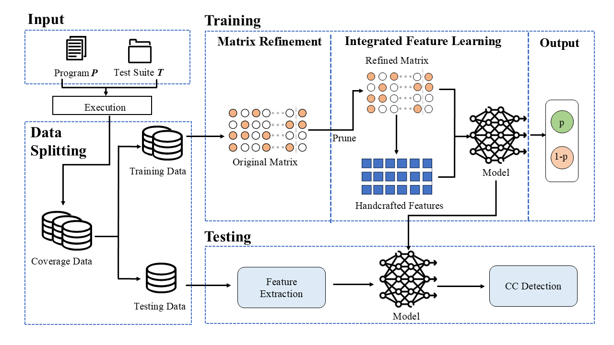

# FusionCC

## Enhanced Feature Representation via Hybrid Feature Fusion for Coincidental Correctness Detection



## Quick Start
### Requirements
- Python Package:
   - chardet==4.0.0
   - numpy==1.20.3
   - pandas==1.3.4
   - pyclustering==0.10.1.2
   - PyYAML==6.0
   - scikit_learn==1.2.1
   - scipy==1.7.1
   - torch==1.10.2

``pip install -r requirements.txt``

### Empirical Study
The scripts below are running with our hand-made data Chart-0 for a quick start.
The full Defects4J coverage data can be found at https://bitbucket.org/rjust/fault-localization-data/src/master/


### RQ1 & RQ2
- Run the scripts in `./cc/cc_baselines`
Run the script in `./cc/fusion_cc_identify/run_fusion.py`
The output can be found under folder `./results/`

#### RQ3
- Run the script: `./cc/fusion_cc_identify/run_fusion.py`
The output can be found under folder `./results/the_approach-trim` and `./results/the_appraoch-relabel`

#### RQ4
The output can be found under folder `./results/the_approach/time.txt`

Eample output:

- origin_record.txt
  - meaning: ``program-id real_cc_num detected_cc_num intersection_of_them``
  - example: ``Chart-0	4	4	4``
- record.txt
  - meaning: ``program-id recall precision F1``
    - example: ``Chart-0	1.0	1.0	1.0``
- approach_MFR.txt or approach_MAR.txt
  - meaning: ``program-id MFR_or_MAR_value_list``
  - example: ``Chart-0	1	1	1``
- time.txt
  - meaning: ``program-id time_cost``
  - example: ``Chart-0	12.20``

## Project Structure
```
fusionCC
├── CONFIG.py
├── requirements.txt
├── cc
│   ├── CCGroundTruthPipeline.py
│   ├── CCinfo.yaml
│   ├── ReadData.py
│   ├── allinfo.yaml
│   ├── cc_baselines        # baselines
│   ├── cc_evaluation       # evaluation metrics of CCT detection
│   ├── core.py
│   ├── survey_pipeline
│   ├── fuion_cc_model     # model
│   └── fusion_cc_identify 
│       ├── ...
│       └── run_fusion.py  # entry
├── data            # (hand-made) example data 
├── fl_evaluation   # the suspicious evaluation of FL
├── read_data       # read data
├── results         # results 
└── utils           
```

